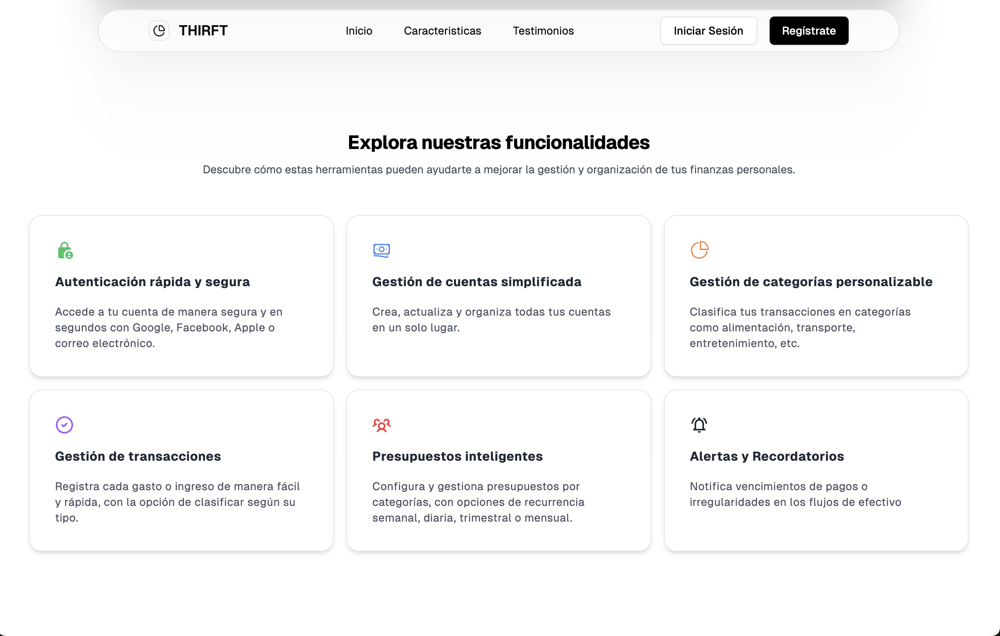
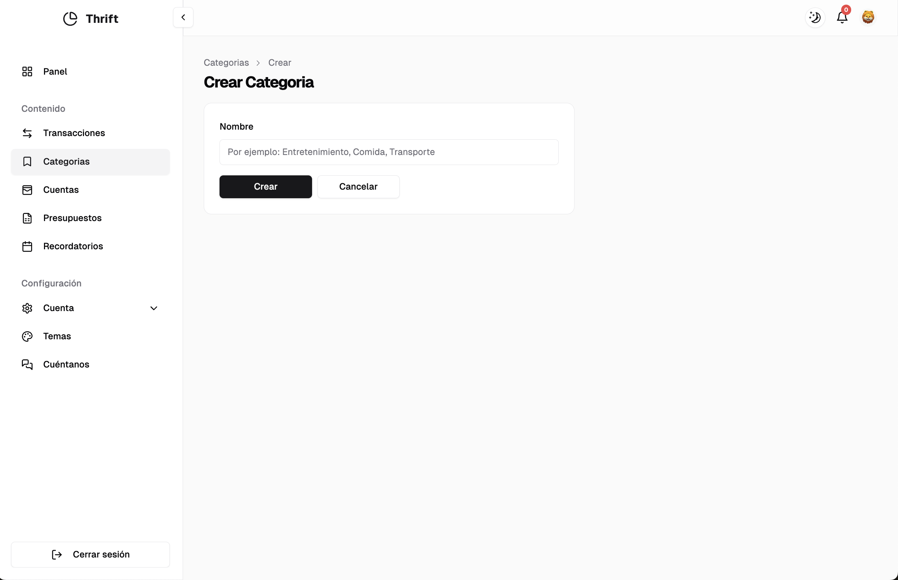
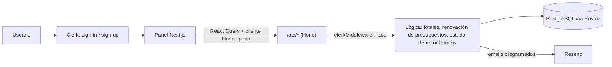

# Thrift

> Aplicación web de finanzas personales para registrar ingresos y gastos, organizarlos por cuentas y categorías, y controlarlos con presupuestos y recordatorios.


**¿Por qué "Thrift"?** Viene del nórdico antiguo *þrift* ("prosperidad", de *þrifask*, "prosperar"), emparentado con el inglés *thrive*. Con el tiempo pasó a significar **ahorro y buen uso de los recursos**: justo lo que la app busca que hagas con tu dinero.

---

## Overview

Thrift ayuda a una persona a responder tres preguntas sobre su dinero: **¿cuánto entra?, ¿cuánto sale? y ¿en qué se va?**

- **Qué es:** una aplicación web (Next.js) con landing pública y un panel privado por usuario.
- **Qué problema resuelve:** centraliza el registro manual de transacciones y permite fijar límites de gasto por categoría, con avisos cuando te acercas o superas ese límite.
- **Para quién:** personas que quieren llevar un control simple de sus finanzas personales. La interfaz está en español y los montos se muestran en soles (`PEN`).

## Features

### Núcleo financiero
- **Transacciones**: crear, editar, eliminar y eliminar en lote. Cada una tiene fecha, cuenta, categoría (opcional), beneficiario, monto y notas. Los montos positivos son ingresos y los negativos, gastos.
- **Cuentas**: crear y editar cuentas (p. ej. Efectivo, Banco, Tarjeta de crédito).
- **Categorías**: crear y editar categorías (p. ej. Comida, Transporte).

### Análisis
- **Panel (dashboard)**: saldo, ingresos y gastos del período con la variación porcentual respecto al período anterior.
- Filtros por **rango de fechas** (30 días por defecto) y por **cuenta**.
- Gráfico de transacciones en el tiempo (área, barras o línea) y gasto por categoría (circular, radar o radial), con Recharts.

### Control de gasto
- **Presupuestos** por categoría con monto, período (`DIARIO`, `SEMANAL`, `MENSUAL`, `TRIMESTRAL`, `ANUAL`, `PERSONALIZADO`) y rango de fechas. Muestran cuánto se ha gastado del presupuesto.
- **Presupuestos recurrentes**: cuando termina el período, las fechas se renuevan automáticamente (al consultar la lista).
- **Recordatorios**: con título, descripción y fecha. Se pueden vincular a un presupuesto con un **monto** o un **umbral (%)**. Cambian de estado a `PROXIMO` (≥ 90 % del límite) o `EN_PROCESO` (límite alcanzado).
- **Notificaciones en la app**: un panel lateral muestra los recordatorios en estado `PROXIMO` o `EN_PROCESO`.
- **Recordatorios por correo**: se programan emails con Resend al crear o editar un recordatorio.

### Personalización y comunidad
- **Temas**: modo claro/oscuro y colores de acento (Zinc, Rose, Blue, Green, Orange).
- **Cuenta**: perfil y seguridad gestionados con los componentes de Clerk.
- **Cuéntanos**: los usuarios pueden dejar comentarios. Los que se marcan como visibles (`visible = true` en la base de datos) aparecen como testimonios en la landing.

### Estado de funcionalidades

| Funcionalidad | Estado | Evidencia |
|---|---|---|
| Transacciones, cuentas, categorías, presupuestos, recordatorios, panel | Implementado | `src/app/api/[[...route]]/*`, `src/features/*` |
| Importar transacciones desde CSV | Parcial | Se puede cargar y previsualizar el CSV, pero al confirmar solo se hace `console.log`. Existe el endpoint `POST /api/transacciones/bulk-create`, pero la UI aún no lo usa |
| Notificaciones push (Web Push) | Prototipo, sin conectar | `public/service.js`, `src/components/notifications.tsx` y `src/utils/db/in-memory-db.ts` existen, pero no se usan en ninguna página |
| Scheduler (`cron.js`) | Incompleto | Llama a `/api/services/scheduler`, una ruta que no existe |
| Membresía | Placeholder | La página `/membresia` existe, pero su entrada en el menú está comentada |
| Eliminar cuentas y categorías | No implementado | Sus endpoints solo tienen `GET`, `POST` y `PATCH` |

## Screenshots

**Funcionalidades presentadas en la landing**



**Panel financiero**: saldo, ingresos, gastos y gráficos filtrables por fecha y cuenta.


**Registro de transacciones**


**Categorías y cuentas**

| Crear categoría | Crear cuenta |
|---|---|
|  |  |

**Presupuesto recurrente por categoría**


## How It Works



**Flujo típico**

1. El usuario crea sus **cuentas** y **categorías**.
2. Registra **transacciones** (ingreso con monto positivo, gasto con monto negativo).
3. Define un **presupuesto** por categoría y período.
4. Crea un **recordatorio** vinculado al presupuesto con un umbral (p. ej. 90 %).
5. Cada vez que se consultan los recordatorios, el backend suma los gastos de esa categoría dentro del período del presupuesto y actualiza el estado del recordatorio. La campana del panel muestra los que están `PROXIMO` o `EN_PROCESO`.

> Toda la lógica de renovación y de alertas se ejecuta **al hacer la petición** (cuando se llama a `GET /api/presupuestos` o `GET /api/recordatorios/notifications`). No hay ningún job en segundo plano en funcionamiento.

## Tech Stack

| Área | Tecnología |
|---|---|
| Framework | Next.js 14 (App Router), React 18 |
| Lenguaje | TypeScript |
| API | Hono montado en `src/app/api/[[...route]]/route.ts`, con cliente RPC tipado (`hono/client`) |
| Base de datos | PostgreSQL + Prisma ORM |
| Autenticación | Clerk (`@clerk/nextjs`, `@hono/clerk-auth`, localización `esES`) |
| Validación | Zod (`@hono/zod-validator` en el backend, `react-hook-form` + `@hookform/resolvers` en el frontend) |
| Data fetching | TanStack Query v5 |
| Estado del cliente | Zustand (sheets y sidebar) |
| UI | Tailwind CSS, componentes estilo shadcn/ui (Radix UI), NextUI, Framer Motion, lucide-react |
| Tablas y gráficos | TanStack Table, Recharts |
| Email | Resend + React Email |
| Fechas | date-fns, date-fns-tz |
| CSV | react-papaparse |

## Architecture

- **Frontend (App Router)**
  - `src/app/page.tsx`: landing pública.
  - `src/app/(auth)`: páginas de Clerk (`/sign-in`, `/sign-up`).
  - `src/app/(dashboard)`: panel privado con sidebar (`AdminPanelLayout`).
- **Backend**: una sola app Hono en `/api` que agrupa los routers `cuentas`, `categorias`, `transacciones`, `presupuestos`, `recordatorios`, `comentarios` y `summary`. Exporta `AppType`, que el cliente usa en `src/lib/hono.ts` para tener tipos de extremo a extremo.
- **Organización por feature**: `src/features/<feature>/api` contiene hooks de React Query (`use-get-*`, `use-create-*`, …), `components/` los formularios y columnas de tabla, y `types/` los tipos de la feature.
- **Persistencia**: Prisma (`src/lib/prismadb.ts`). Los datos se aíslan por `userId` de Clerk. Los montos se guardan como enteros en **miliunidades** (`convertAmountFromiMiliunits` en `src/lib/utils.ts`).
- **Servicios externos**: Clerk (identidad), Resend (correo), PostgreSQL.

### Modelo de datos (Prisma)

`Cuentas` 1—N `Transacciones` N—1 `Categorias` 1—N `Presupuestos` 1—N `Recordatorios` 1—N `Notificaciones`. Además existen `Comentarios`, `Preguntas` y `Respuestas`; estos dos últimos no se usan todavía en ninguna API.

### Endpoints

| Recurso | Rutas |
|---|---|
| `/api/cuentas` | `GET /`, `GET /paginated`, `GET /:id`, `POST /`, `PATCH /:id` |
| `/api/categorias` | `GET /`, `GET /:id`, `POST /`, `PATCH /:id` |
| `/api/transacciones` | `GET /` (filtros `from`, `to`, `accountId`), `GET /:id`, `POST /`, `POST /bulk-create`, `POST /bulk-delete`, `PATCH /:id`, `DELETE /:id` |
| `/api/presupuestos` | `GET /`, `GET /:id`, `POST /`, `POST /bulk-delete`, `PATCH /:id`, `DELETE /:id` |
| `/api/recordatorios` | `GET /`, `GET /notifications`, `GET /:id`, `POST /`, `PATCH /:id`, `DELETE /:id` |
| `/api/comentarios` | `GET /` (público, solo visibles), `GET /:id`, `POST /` |
| `/api/summary` | `GET /` (filtros `from`, `to`, `accountId`) |

## Project Structure

```text
prisma/
├── schema.prisma        # Modelos y enums
├── migrations/          # Migraciones de PostgreSQL
└── seed.ts              # Datos de ejemplo (categorías y transacciones)
public/                  # Imágenes, íconos, mocks y service worker (service.js)
src/
├── app/
│   ├── (auth)/          # Sign-in / sign-up de Clerk
│   ├── (dashboard)/     # Panel, transacciones, cuentas, categorías, presupuestos, recordatorios, temas, cuéntanos
│   ├── api/[[...route]] # API Hono
│   └── page.tsx         # Landing
├── components/          # Componentes compartidos, gráficos, tablas, admin-panel/, ui/
├── features/            # Hooks de API, formularios y tipos por dominio
├── hooks/               # Hooks de UI (sidebar, store)
├── lib/                 # Prisma, cliente Hono, utilidades, temas, menú
├── providers/           # Theme, React Query, sheets
└── middleware.ts        # Protección de rutas con Clerk
```

## Getting Started

### Requirements

- Node.js (compatible con Next.js 14; se recomienda 18.17 o superior)
- npm (el repositorio incluye `package-lock.json`)
- Una base de datos PostgreSQL
- Cuentas en **Clerk** y **Resend**

### Installation

```bash
npm install          # también ejecuta "prisma generate" (postinstall)
npx prisma migrate deploy   # aplica las migraciones existentes
```

Opcional, para cargar datos de ejemplo:

```bash
npx prisma db seed
```

> `prisma/seed.ts` usa un `userId` de Clerk y un `cuentaId` escritos directamente en el código. Cámbialos por los tuyos antes de ejecutarlo.

### Environment Variables

Crea un archivo `.env` en la raíz del proyecto (existe una plantilla en `.env.template`):

```env
# Base de datos (Prisma lee DATABASE_URL)
DATABASE_URL=

# URL pública de la app; la usa el cliente Hono (p. ej. http://localhost:3000)
NEXT_PUBLIC_APP_URL=

# Clerk
NEXT_PUBLIC_CLERK_PUBLISHABLE_KEY=
CLERK_SECRET_KEY=
NEXT_PUBLIC_CLERK_SIGN_IN_URL=/sign-in
NEXT_PUBLIC_CLERK_SIGN_UP_URL=/sign-up

# Resend (emails de recordatorios)
RESEND_API_KEY=
```

Variables opcionales que lee `src/app/layout.tsx` para `metadataBase`: `APP_URL`, `VERCEL_URL` y `PORT`.

> `.env.template` define `DATABASE_URL_DEV` y `DATABASE_URL_PRO`, pero `schema.prisma` solo lee `DATABASE_URL`.

### Development

```bash
npm run dev     # servidor de desarrollo (http://localhost:3000)
npm run build   # build de producción
npm run start   # sirve el build
npm run lint    # ESLint (next lint)
```

## Development Guidelines

- **Idioma del dominio**: los modelos, rutas y features usan nombres en español (`transacciones`, `presupuestos`, `recordatorios`…). Mantén esa convención.
- **Nueva feature**: añade un router Hono en `src/app/api/[[...route]]/`, regístralo en `route.ts` y crea los hooks en `src/features/<feature>/api` usando `client` de `@/lib/hono`.
- **Validación**: valida `param`, `query` y `json` con `zValidator` y comprueba `getAuth(c).userId` en cada handler.
- **Montos**: guárdalos en miliunidades y conviértelos con las utilidades de `src/lib/utils.ts`.
- **Imports**: usa el alias `@/*` → `src/*`.
- **ESLint**: extiende `next/core-web-vitals` y `next/typescript`, con algunas reglas relajadas (`no-explicit-any`, `no-unused-vars`) en `.eslintrc.json`.

## Testing

El proyecto **no tiene tests automatizados** ni un framework de testing configurado, y no existe un script `test` en `package.json`. La única verificación automática disponible es `npm run lint`.

## Security

Mecanismos existentes:

- **Autenticación**: Clerk. `src/middleware.ts` protege todas las páginas excepto `/`, `/sign-in`, `/sign-up` y `/api/*`.
- **Autorización en la API**: cada router usa `clerkMiddleware()` de `@hono/clerk-auth`, responde `401` si no hay `userId` y filtra las consultas por el `userId` del usuario.
- **Validación de entrada**: esquemas Zod en los endpoints.
- **Secretos**: se leen de variables de entorno, y `.gitignore` excluye `.env*`.

Aspectos a revisar:

- `src/config.ts` contiene **claves VAPID (pública y privada) escritas en el código**. Deberían moverse a variables de entorno y rotarse.
- Los emails se envían desde el remitente de prueba de Resend (`onboarding@resend.dev`).
- No hay rate limiting ni cabeceras de seguridad personalizadas configuradas.
- El middleware deja `/api/*` como público a nivel de Next; la protección depende de que cada handler compruebe la sesión.

## Deployment

No hay configuración de deployment en el repositorio (ni `vercel.json`, ni Dockerfile, ni CI). `src/app/layout.tsx` tiene en cuenta `VERCEL_URL`, y el handler de la API usa `hono/vercel`, lo que apunta a Vercel como destino previsto.

Para desplegar se necesita:

1. Configurar las variables de entorno anteriores.
2. Ejecutar `npx prisma migrate deploy` contra la base de datos de producción.
3. Ejecutar `npm run build` y luego `npm run start`.

> `cron.js` (servidor Express con socket.io) y `server.js` (script de prueba de Resend) no forman parte del flujo de ejecución ni de ningún script de `package.json`.

## Roadmap

Solo se incluye lo que tiene evidencia en el código:

- **En progreso**: importación de transacciones por CSV (falta conectar la confirmación con `bulk-create`).
- **Prototipo**: notificaciones push con service worker.
- **Planeado (sin implementar)**: membresía (página placeholder), scheduler de recordatorios (`cron.js`), modelos `Preguntas` / `Respuestas`.

## Documentation

No existe una carpeta `docs/`. Las referencias principales son:

- [prisma/schema.prisma](prisma/schema.prisma): modelo de datos
- [src/app/api/[[...route]]/route.ts](src/app/api/%5B%5B...route%5D%5D/route.ts): punto de entrada de la API
- [src/lib/menu-list.ts](src/lib/menu-list.ts): navegación del panel

## Contributing

1. Crea una rama desde `main`.
2. Ejecuta `npm run lint` antes de abrir un PR.
3. Si cambias `schema.prisma`, genera una migración con `npx prisma migrate dev --name <nombre>`.

## License

El repositorio no incluye un archivo de licencia.
