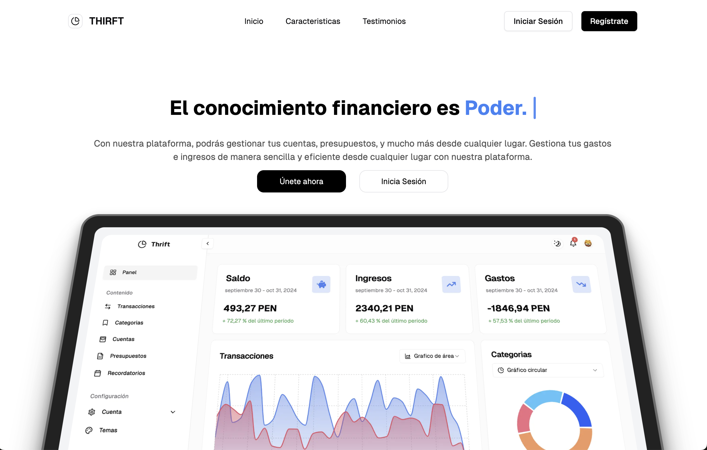
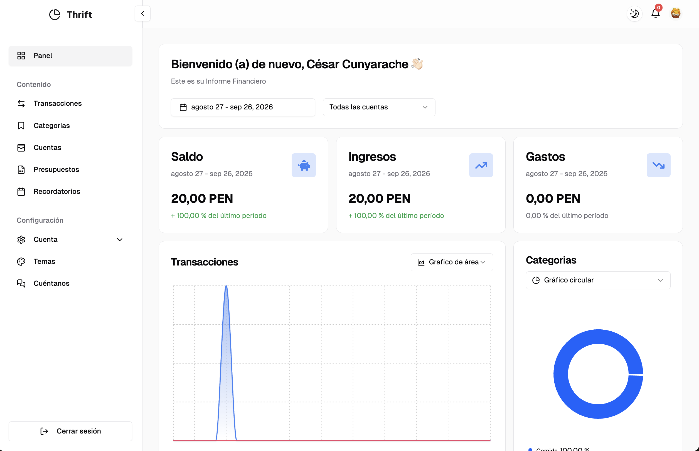
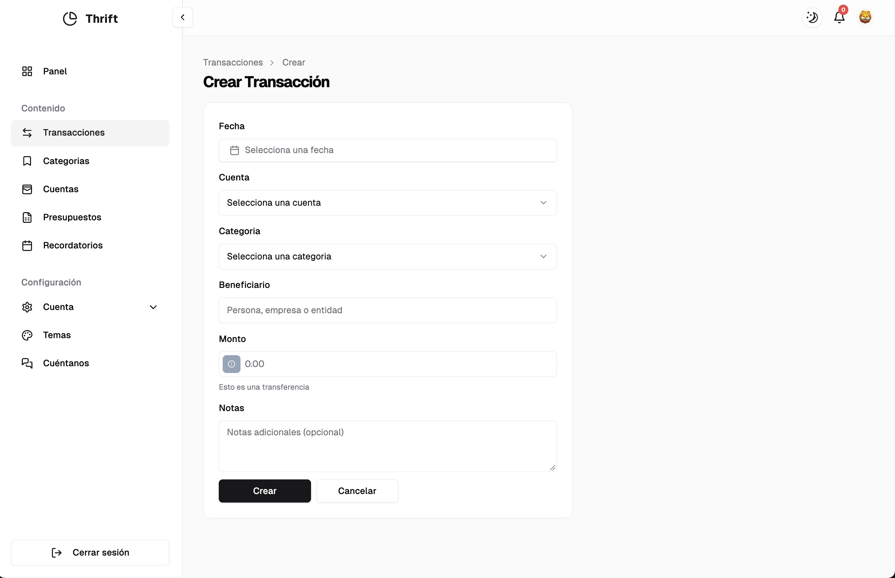
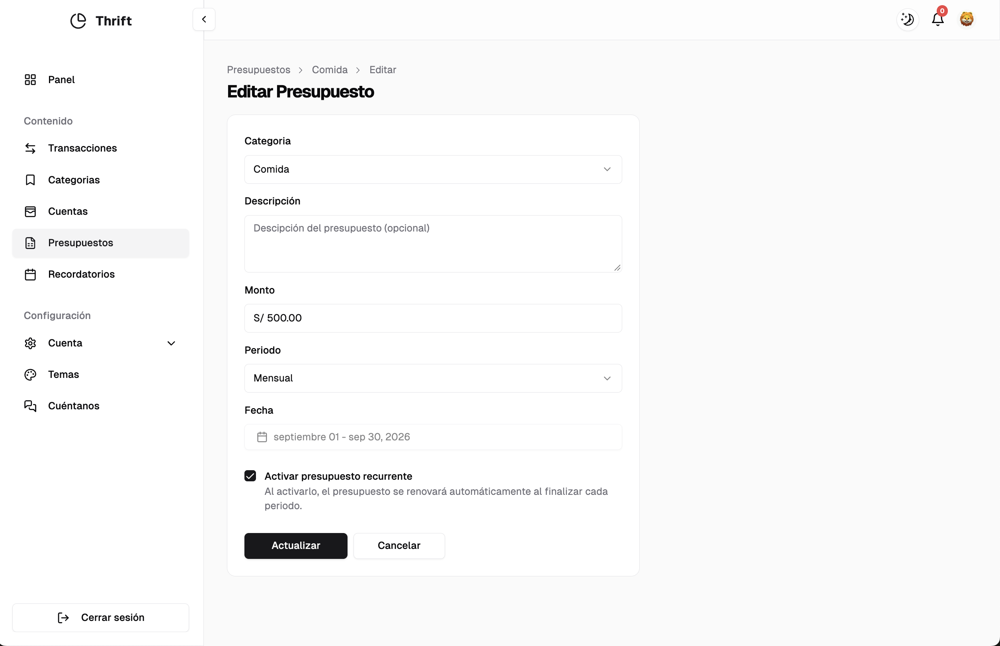

# Thrift

> Una app web para registrar tus ingresos y gastos, ver a dónde se va tu dinero y ponerle límites.



## Overview

Thrift es una app de finanzas personales. Anotas lo que entra y lo que sale, lo organizas por cuentas y categorías, y el panel te muestra tu saldo, tus ingresos y tus gastos del período.

Además, puedes crear presupuestos por categoría y recordatorios que te avisan cuando te acercas al límite o ya lo superaste.

Está pensada para quien quiere llevar sus cuentas de forma simple, sin hojas de cálculo. La interfaz está en español y los montos se muestran en soles (PEN).

El nombre viene del nórdico antiguo *þrift*, que significaba "prosperidad". Con el tiempo pasó a significar **ahorro y buen uso de los recursos**.

## Features

- **Transacciones**: registra ingresos y gastos con fecha, cuenta, categoría, beneficiario y notas. Puedes editarlas y borrar varias a la vez.
- **Cuentas y categorías**: por ejemplo, Efectivo o Banco como cuentas, y Comida o Transporte como categorías.
- **Panel**: saldo, ingresos y gastos, con la variación respecto al período anterior. Se filtra por fechas y por cuenta, y trae gráficos de evolución y de gasto por categoría.
- **Presupuestos**: un monto por categoría y período (diario, semanal, mensual, trimestral, anual o personalizado). Si lo marcas como recurrente, se renueva solo.
- **Recordatorios**: se vinculan a un presupuesto con un monto o un porcentaje. Aparecen en la campana de notificaciones y también se programan por email.
- **Personalización**: modo claro u oscuro y varios colores de acento.
- **Cuéntanos**: un formulario de comentarios. Los que se aprueban aparecen como testimonios en la landing.

| Panel | Nueva transacción | Presupuesto | Recordatorio |
|---|---|---|---|
|  |  |  |  |

## Tech Stack

- **Next.js 14** (App Router) + **TypeScript**
- **Hono** para la API (`/api/*`), con un cliente tipado
- **PostgreSQL** + **Prisma**
- **Clerk** para la autenticación
- **TanStack Query**, **Zod** y **React Hook Form**
- **Tailwind CSS**, componentes de shadcn/ui (Radix) y **Recharts**
- **Resend** para los emails

## Getting Started

### Requirements

- Node.js 18.17 o superior
- Una base de datos PostgreSQL
- Cuentas en [Clerk](https://clerk.com) y [Resend](https://resend.com)

### Installation

```bash
npm install                 # también ejecuta prisma generate
npx prisma migrate deploy   # crea las tablas
npm run dev
```

La app queda disponible en [http://localhost:3000](http://localhost:3000).

### Environment

Crea un archivo `.env` en la raíz del proyecto:

```env
DATABASE_URL=
NEXT_PUBLIC_APP_URL=http://localhost:3000

NEXT_PUBLIC_CLERK_PUBLISHABLE_KEY=
CLERK_SECRET_KEY=
NEXT_PUBLIC_CLERK_SIGN_IN_URL=/sign-in
NEXT_PUBLIC_CLERK_SIGN_UP_URL=/sign-up

RESEND_API_KEY=
```

### Development

```bash
npm run dev      # desarrollo
npm run build    # build de producción
npm run start    # sirve el build
npm run lint     # ESLint
```

Si quieres datos de ejemplo, ejecuta `npx prisma db seed`. Antes, cambia el `userId` y el `cuentaId` que están fijos en `prisma/seed.ts`.

## Project Structure

```text
prisma/              # esquema, migraciones y seed
src/
├── app/
│   ├── (auth)/      # login y registro
│   ├── (dashboard)/ # páginas del panel
│   └── api/         # API en Hono
├── features/        # hooks, formularios y tipos por dominio
├── components/      # UI compartida y gráficos
└── lib/             # Prisma, cliente de la API y utilidades
```

## Status

Las funciones principales están operativas: transacciones, cuentas, categorías, panel, presupuestos y recordatorios.

Lo que sigue en desarrollo:

- **Importar CSV**: ya permite cargar y previsualizar el archivo, pero todavía no guarda las transacciones.
- **Notificaciones push**: hay un prototipo, pero no está conectado a la app.
- **Membresía**: la página existe, pero aún no tiene contenido.
- **Eliminar cuentas y categorías**: todavía no se puede.

No hay tests automatizados.
